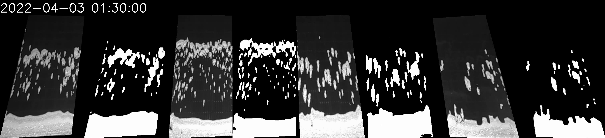
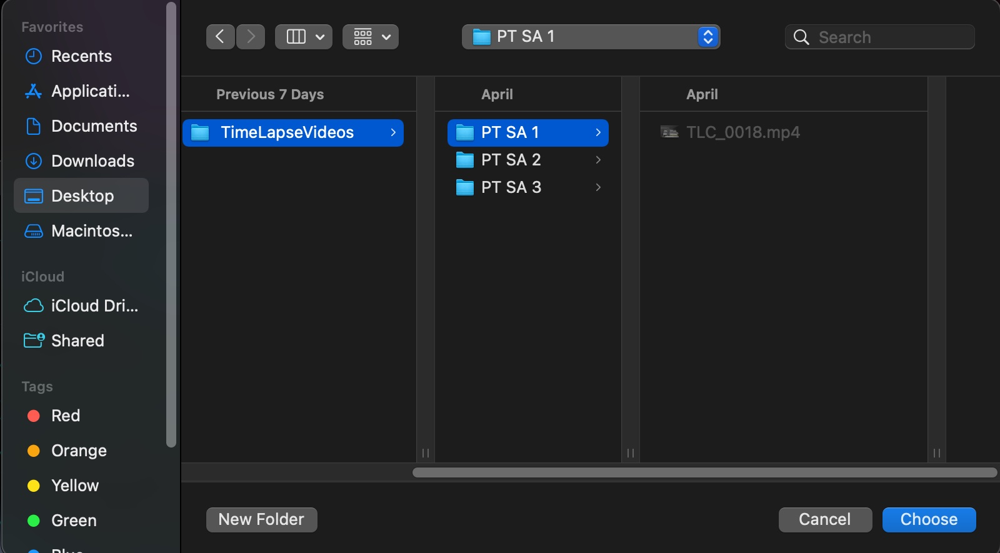
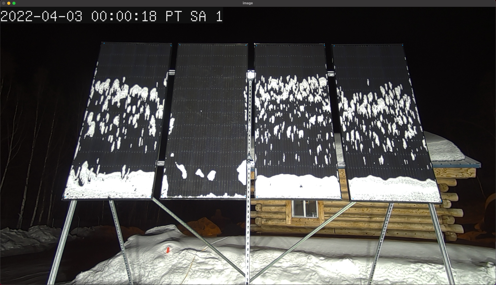
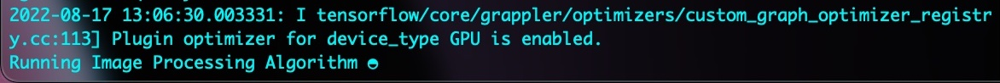
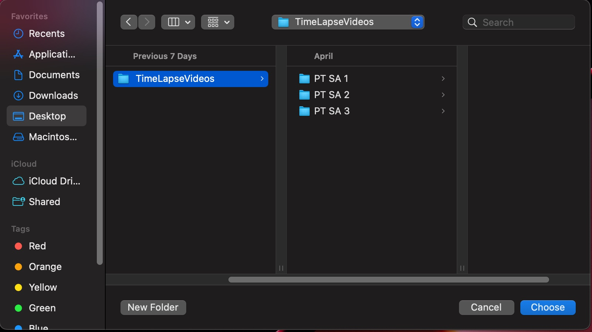
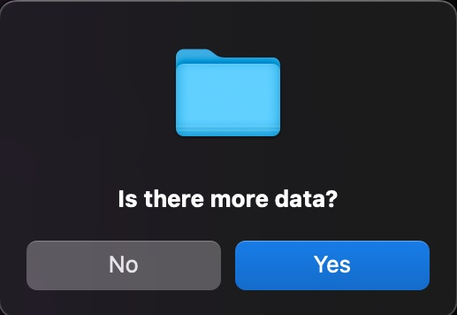
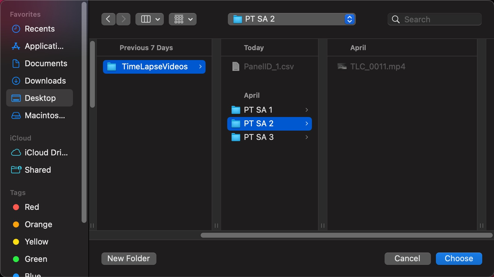
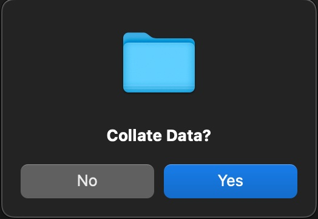

# CRREL-Solar-Project

## Getting Started
To get started make sure you have tensorflow installed, and working on your machine. If you are using Apple's M-Series hardware follow [this](https://developer.apple.com/metal/tensorflow-plugin/) guide to get it working on your machine. For everything else simply follow the install instructions indicated on the Tensorflow Website [here](https://www.tensorflow.org/install/pip).

Then navigate to the project directory and run the following command to setup all the relevant libraries.
```
pip install -r requirements.txt
```
... (for everyone at CRREL this step is already done on my work computer 👍) 
## User Guide
To use this script its important that the time-lapse's are stored in the following directory structure. 
```     
├── TimeLapseVideos                    
│   ├── PT SA 1 
│   │   ├── Time-Lapse#1.mp4
│   │   ├── Time-Lapse#2.mp4
│   │   └── ...
│   ├── PT SA 2     
│   │   ├── Time-Lapse#1.mp4
│   │   ├── Time-Lapse#2.mp4
│   │   └── ...
│   └── PT SA 3   
│   │   ├── Time-Lapse#1.mp4
│   │   ├── Time-Lapse#2.mp4
│   │   └── ...            
```
It's not important what the folders are called but it is important that the videos are separated by solar array. 
To run the script, navigate to the project directory and run the following command, 
```
python MainScript.py
```
Or you can simply double click on the MainScript.py file in the project directory. 

A terminal window and a prompt window will pop up. The terminal window will display status updates while the script is running, so we'll want to keep an eye on it while we process data. The prompt that first appears looks like this.


Selecting 'yes' will generate a single test video which compiles every video in a solar panel array directory and their snow segmentation mask prediction together. The video will be named 'output_video.avi' and here is a screenshot of what this video looks like.



In the file dialog window navigate to the first directory of videos that we want to process. It should look like this,



The script will then display the first frame of the first video in the chosen directory. Simply click on the corners of the solar panels, starting from the leftmost panel in a clockwise or counterclockwise direction. As you click on the corners, a small blue '+' will let you know that the location is registered. once you've clicked every corner the display should look something like this, 



Hit escape to continue to the image processing section of the script. The display image will disappear and you'll see, in the terminal window a progress spinner that will let you know that the image processing algorithm is running. The spinner refreshed once per frame that is processed.  



If there is more than one video in the directory, the script will move to the next video, display the first frame for you to identify the corners of the panels, and run the image processing algorithm. Once we have processed every video in a directory another file dialog window will open. Choose a directory to save the output data for this panel array. In this example I have chosen the parent directory of the time-lapse videos. 



Now the script will save the snow cover data from that array to a .csv file, the file directory will look like this.

```     
├── TimeLapseVideos    
│   ├── PanelID_1.csv                
│   ├── PT SA 1
│   │   ├── output_video.avi 
│   │   ├── Time-Lapse#1.mp4
│   │   ├── Time-Lapse#2.mp4
│   │   └── ...
│   ├── PT SA 2     
│   │   ├── Time-Lapse#1.mp4
│   │   ├── Time-Lapse#2.mp4
│   │   └── ...
│   └── PT SA 3   
│   │   ├── Time-Lapse#1.mp4
│   │   ├── Time-Lapse#2.mp4
│   │   └── ...            
```
The script will then prompt the user if there is any more data. 



Selecting 'yes' will loop the script back to the beginning, asking if we want to generate a test video, and opening another file dialog window for the user to select another video directory to process. This time select the second directory and repeat the process until we've processed all three solar arrays. 



Having done so, your project directory should now look like this. 
```     
├── TimeLapseVideos    
│   ├── PanelID_1.csv                
│   ├── PanelID_2.csv  
│   ├── PanelID_3.csv  
│   ├── PT SA 1
│   │   ├── output_video.avi 
│   │   ├── Time-Lapse#1.mp4
│   │   ├── Time-Lapse#2.mp4
│   │   └── ...
│   ├── PT SA 2     
│   │   ├── output_video.avi 
│   │   ├── Time-Lapse#1.mp4
│   │   ├── Time-Lapse#2.mp4
│   │   └── ...
│   └── PT SA 3   
│   │   ├── output_video.avi 
│   │   ├── Time-Lapse#1.mp4
│   │   ├── Time-Lapse#2.mp4
│   │   └── ...            
```
Since there is no more data to process we click 'no' on the 'is there more data?' prompt. Then the script will prompt the user if they would like to collate the data. 



Selecting 'yes' will open another file dialog window, here you want to select the folder that contains all of our generated .csv files (In this case it's the TimeLapseVideos folder). Now the script will read in each .csv file and collate them together into one master file. 
The final directory will look like this, 

```     
├── TimeLapseVideos    
│   ├── CollatedFinalData.csv
│   ├── PanelID_1.csv                
│   ├── PanelID_2.csv  
│   ├── PanelID_3.csv  
│   ├── PT SA 1
│   │   ├── output_video.avi 
│   │   ├── Time-Lapse#1.mp4
│   │   ├── Time-Lapse#2.mp4
│   │   └── ...
│   ├── PT SA 2     
│   │   ├── output_video.avi 
│   │   ├── Time-Lapse#1.mp4
│   │   ├── Time-Lapse#2.mp4
│   │   └── ...
│   └── PT SA 3   
│   │   ├── output_video.avi 
│   │   ├── Time-Lapse#1.mp4
│   │   ├── Time-Lapse#2.mp4
│   │   └── ...            
```

When ingesting a new batch of videos, redo this step with only new videos and append the new 'CollatedFinalData.csv' to the previous 'CollatedFinalData.csv'. 

## Tips
The new somewhat parallelized script runs around 2.5x faster than the previous version, so it's more feasible to processes longer videos and larger batches of videos. Be very careful when clicking the corners of the panels if you miss click it will likely be easier to close out the script and restart on the video directory that you were processing when you miss clicked. Also when clicking the corner of the panels, don't go all the way out to the edge, leave a little bit of space between the edge and the point where you click. This is because sometimes the algorithm confuses the gaps where we can see through the bottom of the panel as snow. 

## [Full Report](https://raw.githubusercontent.com/StefanoFochesatto/CRREL-Solar-Project/main/Report/CRREL%20Solar%20Imaging%20Project.pdf)